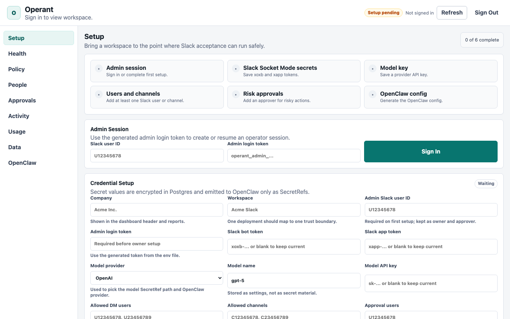
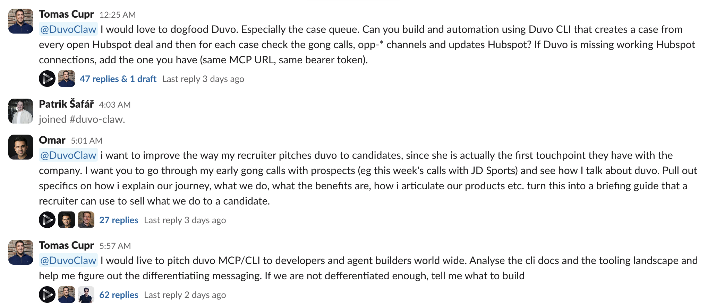

# Operant

[](LICENSE)
[](https://github.com/tomascupr/operant/actions/workflows/verify.yml)
[](package.json)

**Self-hosted agents in Slack — per-user OAuth, per-human audit.**

Hosted agents in Slack share one bot identity across your whole company.
Every employee's actions land in the audit log under "the workspace did
it." Operant doesn't. Each Slack user OAuths their own Gmail, Notion,
GitHub, Linear, HubSpot. The agent calls those tools under that human's
connection, and every session, policy decision, and tool call names the
person who triggered it.



## Quickstart

```bash
pnpm install
pnpm init:env
pnpm compose:up -- -d
pnpm doctor
open http://localhost:8080
```

Sign in with the `OPERANT_ADMIN_LOGIN_TOKEN` from your generated `.env`
plus your Slack member ID (Slack profile → "Copy member ID"). The
**Setup** tab then walks you through Slack/model credentials — create
the Slack app from
[deploy/slack/manifest.yaml](deploy/slack/manifest.yaml) first
(see [deploy/slack/README.md](deploy/slack/README.md)). Full
walkthrough in **[docs/setup.md](docs/setup.md)**.

Requirements: Node 24+, pnpm 11+, Docker Compose v2.

Don't have pnpm 11 yet? Run `corepack enable` once — Node 24 ships
with Corepack and uses the pnpm version pinned in `package.json`.

## How it works

Operant pairs with [OpenClaw](https://docs.openclaw.ai), a permissively-
licensed agent runtime that owns Slack Socket Mode, agent sessions, the
browser / cloud-computer, and tool execution. Operant adds the
enterprise control plane around it: BYOK credentials, RBAC, policy,
approvals, audit, retention, usage tracking, and the admin dashboard.

```
Slack ──> OpenClaw gateway ──> Operant policy + audit ──> Postgres
                            └─> Pipedream Connect (per-user OAuth)
```

Slack app tokens, bot tokens, and model API keys live AES-256-GCM
encrypted in your Postgres. Per-user tool OAuth (Gmail / Notion / GitHub
/ ...) is held by [Pipedream Connect](https://pipedream.com/docs/connect)
under each Slack user's external ID. Custom non-Pipedream tool
credentials can also be stored encrypted in your Postgres, scoped to the
workspace or to a specific Slack user.

## What you get

- Per-user OAuth across 2,500+ SaaS tools via the optional Operant
  OpenClaw plugin and Pipedream Connect. First call per app posts a
  Pipedream connect link in Slack; subsequent calls run under that human.
- Six built-in roles (`owner`, `admin`, `integration_admin`,
  `billing_usage_admin`, `member`, `viewer`) plus arbitrary custom
  `(action, resource)` permissions. Channel allowlists, per-Slack-user
  and per-role tool entitlements, named-approver policies for risky
  actions.
- Static same-origin admin dashboard: Setup, Health, Policy, People,
  Approvals, Activity, Usage, Data, OpenClaw operator views. No bundler,
  no external scripts, strict CSP.
- One Postgres for state, optional Redis profile, Docker Compose
  topology with localhost-bound host ports and a per-workspace trust
  boundary. Helm chart and Fly artifacts ship for graduation.
- Sessions, jobs, policy decisions, credential resolutions, usage and
  cost, exports, retention, and wipes are recorded with token-shaped
  strings redacted before persistence.



*Above: a live Operant deployment (branded as @DuvoClaw inside
[Duvo](https://duvo.ai)) running real production conversations.*

## Docs

- **[Setup guide](docs/setup.md)**. Stack, dashboard sign-in, Slack
  app, Pipedream Connect, integration credentials, sandbox overlay.
- **[Acceptance guide](docs/acceptance.md)**. Live verifiers, manual
  human-post mode, strict gates.
- **[Slack app setup](deploy/slack/README.md)**. Manifest, scopes,
  Socket Mode, token helpers.
- **[HTTP API reference](docs/api.md)**. Dashboard and internal
  endpoints.
- **[Contributing](CONTRIBUTING.md)**. Local dev, PR expectations,
  release flow.
- **[Security policy](SECURITY.md)**. Reporting a vulnerability.
- **[Changelog](CHANGELOG.md)**. Release notes and version history.

## License

MIT. See [LICENSE](LICENSE).
